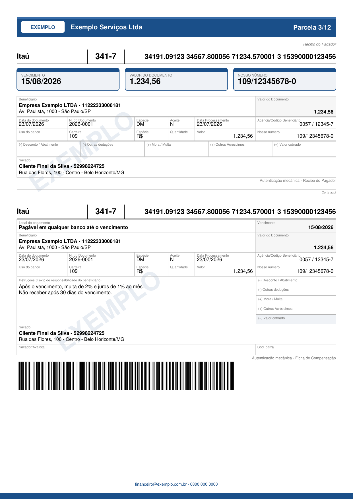

# 11 — Renderização (Estratégia e Tabela de Decisão)

A renderização do boleto é tratada por **backends plugáveis** atrás de uma interface única. O
domínio (cálculo de linha digitável, código de barras, PIX, valores) **nunca** depende do backend;
o backend apenas recebe dados já validados e produz o PDF. Isso permite trocar/coexistir motores
de renderização sem tocar nas regras bancárias.

## Modelos avaliados

| Modelo | Como funciona | Dependências |
|--------|---------------|-------------|
| **ReportLab** | Desenho programático em Python puro, posicionamento absoluto (pt a pt). | Nenhuma dependência de sistema (Python puro). |
| **HTML/CSS + WeasyPrint** | Template Jinja2 → HTML/CSS `print` → PDF. | Bibliotecas nativas (Pango, cairo, GDK-PixBuf). |
| **HTML/CSS + Playwright** | Template Jinja2 → HTML → Chromium headless imprime PDF. | Navegador Chromium no ambiente. |

## Tabela de decisão

Notas de **1 (pior) a 5 (melhor)** nos quatro critérios pedidos. A linha *Dependências de sistema*
não é um dos quatro critérios, mas é a **restrição operacional decisiva** (quanto maior a nota,
menos dependências) — detalhada mais abaixo.

| Critério | ReportLab | HTML/CSS + WeasyPrint | HTML/CSS + Playwright |
|----------|:---------:|:---------------------:|:---------------------:|
| **Simples de Implementar** | 3 — API de baixo nível, verbosa, mas com farto histórico em geração de boletos. | 4 — HTML/CSS + Jinja2 é familiar e produtivo. | 2 — exige orquestrar navegador headless e seu ciclo de vida. |
| **Melhorias Visuais** | 2 — posicionamento absoluto; tema e logo já suportados, mas ajustes finos de layout custam caro. | 4 — CSS torna temas, cores e fontes simples. | 5 — CSS moderno completo, máxima fidelidade de navegador. |
| **Fácil de Manutenção** | 2 — mudança visual mexe em coordenadas; frágil a ajustes. | 4 — layout declarativo, fácil de evoluir. | 4 — layout declarativo, porém com peso operacional do Chromium. |
| **Velocidade de Renderizar** | 5 — Python puro, sem navegador; baixo uso de CPU/memória, ideal para alto volume. | 3 — mais lento que ReportLab; suporta subconjunto de CSS. | 2 — navegador é pesado; maior latência e consumo de memória. |
| **Média dos 4 critérios** | **3,00** | **3,75** | **3,25** |
| *Dependências de sistema* | *5 — nenhuma* | *2 — libs nativas* | *1 — Chromium* |

### Leitura por perfil de uso (média ponderada)

Nenhum modelo domina os quatro critérios — a escolha depende do perfil do deployment. Abaixo,
duas ponderações típicas (soma dos pesos = 100%).

**Perfil A — boleto padrão em produção** (alto volume, serverless/Docker leve, layout regulado):
pesos Velocidade 30%, Manutenção 25%, Visual 20%, Implementar 15%, Dependências 10%.

| Modelo | Cálculo | Total |
|--------|---------|:-----:|
| **ReportLab** | 5·0,30 + 2·0,25 + 2·0,20 + 3·0,15 + 5·0,10 | **3,35** |
| WeasyPrint | 3·0,30 + 4·0,25 + 4·0,20 + 4·0,15 + 2·0,10 | 3,50 |
| Playwright | 2·0,30 + 4·0,25 + 5·0,20 + 2·0,15 + 1·0,10 | 3,00 |

**Perfil B — boleto white-label** (marca/temas frequentes, prévia web, volume moderado):
pesos Visual 30%, Manutenção 25%, Implementar 20%, Velocidade 15%, Dependências 10%.

| Modelo | Cálculo | Total |
|--------|---------|:-----:|
| ReportLab | 2·0,30 + 2·0,25 + 3·0,20 + 5·0,15 + 5·0,10 | 2,95 |
| **WeasyPrint** | 4·0,30 + 4·0,25 + 4·0,20 + 3·0,15 + 2·0,10 | **3,65** |
| Playwright | 5·0,30 + 4·0,25 + 2·0,20 + 2·0,15 + 1·0,10 | 3,30 |

## A restrição decisiva: dependências de sistema

Para rodar em ambientes constrangidos (ex.: 512 MB no Render) e manter a imagem Docker leve, o
gerador de PDF precisa ser **puro Python, sem bibliotecas de sistema**. Isso aponta para o
**ReportLab (zero dependências de sistema)** — e **não** WeasyPrint, que traz Pango/cairo.

Essa é a **contrapartida** do WeasyPrint: ele traz Pango/cairo. Não muda o padrão do projeto (a
prioridade é visual + manutenção — ver "Decisão do projeto" abaixo), mas é o motivo pelo qual o
**ReportLab permanece como alternativa** de alto volume/serverless, a um passo de config quando o
ambiente for muito constrangido.

## Decisão do projeto — REVISADA com paridade visual comprovada + benchmark

A decisão inicial (WeasyPrint padrão) apoiava-se na vantagem visual/manutenção do HTML/CSS.
Dois fatos supervenientes mudaram o veredito:

1. **Paridade visual comprovada.** O backend ReportLab (`modelo="moderno"`) foi validado
   **lado a lado contra imagens de referência** e reproduz o layout por completo — chips,
   célula PIX teal, paleta cinza, carnê e **tema** (faixa de marca, marca d'água, rodapé).
   A vantagem visual do WeasyPrint deixou de existir para os layouts do projeto.
2. **Benchmark em lote (100–200 boletos, mesmos contextos, mesma máquina):**

| Lote | ReportLab | WeasyPrint | Fator |
|:----:|-----------|------------|:-----:|
| 100 | **1,2 s** (11,9 ms/boleto) | 132,1 s (1.321 ms/boleto) | **~111×** |
| 200 | **2,1 s** (10,7 ms/boleto) | 265,2 s (1.326 ms/boleto) | **~124×** |
| Tamanho do PDF | **7,8 KB** | 23,7 KB | 3× |

Para emissão em lote (100–200 boletos), o WeasyPrint levaria **~4,4 minutos** num lote de 200 —
enquanto o ReportLab entrega em **~2 segundos**, viabilizando até resposta síncrona.

> **Padrão promovido a 1º: `ReportLabBackend` (`modelo="moderno"`).** Visual idêntico à
> referência, ~120× mais rápido, PDFs 3× menores e zero dependências de sistema.

### Backend único (decisão final)

> **Render somente pelo ReportLab** (decisão de projeto): a via HTML/CSS + WeasyPrint foi
> **removida do escopo** — os templates Jinja2 saíram do pacote. A análise comparativa acima
> permanece como registro histórico da decisão. Se um dia for necessário white-label além dos
> modelos atuais, um backend HTML poderá ser reavaliado em projeto separado.

## Implementação (backend ReportLab)

O backend único vive no pacote [`pycobranca/render/`](../pycobranca/render/) e é alimentado pelo
domínio via `BancoBase.contexto_render()`. O pacote é dividido por responsabilidade:

| Módulo | Papel |
|--------|-------|
| `comum.py` | constantes, paleta e primitivas (canvas, texto, código de barras, QR, logo) |
| `tela.py` | a `Tela` — canvas + cursor + coordenadas, texto e a célula rotulada |
| `dados.py` | `DadosBoleto`/`extrai_dados` — o **preenchimento dos dados** do boleto |
| `blocos.py` | blocos comuns aos modelos (rótulo, demonstrativo, corte) |
| `modelos/` | **catálogo dos documentos**: `boleto_classico`, `boleto_moderno`, `carne`, `fatura` |

Para adicionar um documento novo, basta criar um módulo em `modelos/` — as camadas de baixo são
compartilhadas (ver o contrato de modelo na docstring de `modelos/__init__.py`).

```python
from datetime import date

from pycobranca.bancos import Bancos
from pycobranca.render import render_boleto_pdf, render_carne_pdf

Banco = Bancos.find("341")
boleto = Banco(
    valor="127.50",
    cedente="Empresa Exemplo LTDA",
    cedente_documento="11.222.333/0001-81",
    agencia="0057",
    conta="12345",
    carteira="109",
    nosso_numero="12345678",
    data_vencimento=date(2026, 8, 15),
    sacado="Cliente Final da Silva",
    sacado_documento="529.982.247-25",
)

pdf = render_boleto_pdf(boleto.contexto_render(), modelo="moderno")
```

- `modelo="moderno"` (padrão recomendado): recibo com chips de destaque, faixa de marca opcional,
  célula PIX e grade de 6 colunas alinhada ao eixo de Vencimento/Valor.
- `modelo="classico"`: layout tradicional (bordas pretas, rótulos em caixa alta).
- `render_carne_pdf({"parcelas": [...]})`: carnê 3×A4.
- `render_fatura_pdf(contexto)`: **fatura** — corpo livre + boleto na mesma página (ver abaixo).
- `desenha_boleto(canvas, contexto, modelo)`: desenha o boleto num canvas existente, para compor o
  boleto dentro de outro documento (é o que a fatura usa).
- `emite_boleto(boleto, modelo, tema=None)`: **PDF e dados numa chamada** (ver abaixo).

### `emite_boleto` — PDF e dados juntos

`render_boleto_pdf` devolve só os bytes. Quem precisa responder com o PDF **e** os números —
qualquer serviço — voltava ao objeto para buscar `linha_digitavel`, `codigo_barras` e
`nosso_numero`, o que remonta o título do zero a cada acesso:

```python
from pycobranca.render import emite_boleto

saida = emite_boleto(boleto, modelo="moderno")
saida.pdf  # bytes
saida.linha_digitavel  # str
saida.codigo_barras
saida.nosso_numero
saida.vencimento
saida.valor_documento
saida.pix_copia_cola  # None quando o boleto não tem PIX
saida.totalizadores  # os cinco campos da faixa FEBRABAN — sempre vazios, ver abaixo
saida.to_dict()  # tudo menos o PDF, pronto para o corpo da resposta
```

O ganho de tempo é pequeno — o desenho do PDF domina a chamada. O que importa é serem **a mesma
montagem**: buscando o PDF de um lado e os números do outro, o papel pode dizer uma coisa e o JSON
outra sem nada avisar. E `contexto_render()`, de onde os dados sairiam, é formato interno do
`render/` — não serve de contrato para quem consome.

### Faixa de encargos: sempre em branco

Os cinco campos da faixa FEBRABAN — `(-) Desconto / Abatimento`, `(-) Outras deduções`,
`(+) Mora / Multa`, `(+) Outros Acréscimos` e `(=) Valor cobrado` — são impressos como **caixas
vazias**, e é assim que devem sair.

Quem preenche essa faixa é o **caixa**, no ato do pagamento: só ali se sabe se houve atraso, quanto
rendeu de juros e se o desconto ainda vale. A regra do título vai no bloco de **instruções**, que é
o que o operador lê para calcular:

```python
boleto = Banco(
    valor="1279.50",
    instrucoes=[
        "Após o vencimento, multa de 2% e juros de 1% ao mês.",
        "Conceder desconto de R$ 150,00 até 10/09/2026.",
    ],
    # ... demais campos do boleto
)
```

Os campos `desconto_abatimento`, `outras_deducoes`, `mora_multa`, `outros_acrescimos` e
`valor_cobrado` continuam existindo no título e no [contrato REST](04-api-rest.md) — servem para
trafegar o encargo entre sistemas. O que eles **não** fazem é chegar ao papel:
`contexto_render()["totalizadores"]` devolve os cinco vazios, informados ou não, e
`BoletoEmitido.totalizadores` acompanha.

!!! warning "Mudou na 1.1.1"
    Até a 1.1.0, o valor informado era impresso e o `(=) Valor cobrado` era **calculado** a partir
    dos outros quatro. Um total impresso antes do pagamento leva o pagador a pagar o valor errado,
    e nada no PDF denuncia — a biblioteca estava fazendo a conta que é do caixa.

### Faixa de marca (`tema`)

O modelo moderno aceita um **tema**: uma faixa de 12 mm no topo com a marca de quem emite, marca
d'água na diagonal e rodapé no pé da página. É opt-in — sem `tema`, nada disso é desenhado.

O tema entra **no contexto de render**, não no construtor do banco:

```python
ctx = boleto.contexto_render()
ctx["tema"] = {
    "habilitado": True,  # sem isto, o bloco inteiro é ignorado
    "cor": "#1B4F8A",  # cor da faixa, da borda dos chips e do rodapé
    "logo_texto": "EXEMPLO",  # selo branco à esquerda (26 mm; encolhe até caber)
    "empresa": "Exemplo Serviços Ltda",  # nome ao lado do selo
    "parcela_texto": "Parcela 3/12",  # canto direito da faixa
    "marca_dagua": "EXEMPLO",  # diagonal, em 10% da cor do tema
    "rodape": "financeiro@exemplo.com.br · 0800 000 0000",
}
pdf = render_boleto_pdf(ctx, modelo="moderno")
```

| Chave | Efeito | Ausente |
|---|---|---|
| `habilitado` | liga o tema | nada é desenhado |
| `cor` | faixa, borda dos chips, marca d'água e rodapé | `#1B4F8A` |
| `logo_texto` | selo branco de 26 mm à esquerda | sem selo; `empresa` começa na margem |
| `empresa` | nome na faixa | omitido |
| `parcela_texto` | texto à direita da faixa | omitido |
| `marca_dagua` | diagonal em duas posições da página | omitida |
| `rodape` | linha centralizada no pé | omitido |



As capturas desta documentação são geradas do próprio renderizador por
[`tools/screenshots.py`](https://github.com/Maxwbh/pyCobranca/blob/main/tools/screenshots.py) —
rode-o depois de mexer no layout, senão elas passam a mostrar um boleto que a biblioteca não
produz mais.

`logo_texto` e `empresa` têm largura limitada e **encolhem o corpo até caber** em vez de invadir a
faixa. Para a marca em imagem (PNG/JPEG) no lugar do nome do banco, use o
[logo opt-in](#logo-opt-in-no-cabecalho) — são mecanismos independentes e combináveis.

> **No contrato REST**, o tema aparece em `BoletoData` com outro vocabulário — `cor_marca`,
> `logo_empresa`, `marca_dagua`, `rodape_contato`, `parcela_atual`/`total_parcelas` — e a tradução
> para as chaves acima é do serviço que expõe a API; a biblioteca não a faz.

## Fatura — corpo livre em 3 níveis

A fatura desenha um **corpo** no topo e o **boleto** logo abaixo. O corpo tem três níveis de
liberdade, do mais simples ao mais aberto — todos em Python puro, **sem engine de HTML**.

> **Por que não HTML?** Renderizar HTML/CSS fielmente exige uma engine de layout (WeasyPrint carrega
> Pango via FFI; wkhtmltopdf é um binário). Isso reintroduziria dependências de sistema e
> contrariaria a decisão de escopo do projeto. Quem precisa de HTML/CSS completo usa os **dados**
> (`contexto_render()`/`to_dict()`) e renderiza na engine que preferir — a engine segue leve.

### Nível 1 — `itens` (tabela pronta)

```python
contexto["itens"] = [
    {"descricao": "Mensalidade — agosto/2026", "quantidade": 1, "valor": 99.90},
    {"descricao": "Serviço adicional", "quantidade": 2, "valor_unitario": 13.80},
]
```

Quando só há `valor`, ele é o total da linha; com `valor_unitario`, o total é
`quantidade × valor_unitario`. O total da fatura é somado automaticamente.

### Nível 2 — `fatura.blocos` (corpo declarativo)

Serve a qualquer modalidade (mensalidade, condomínio, consumo, escola, serviços):

```python
contexto["fatura"] = {
    "titulo": "FATURA DE CONSUMO",
    "blocos": [
        {"tipo": "campos", "itens": [("Período", "01/08 a 31/08"), ("Contrato", "4471")]},
        {
            "tipo": "tabela",
            "colunas": ["Descrição", "Qtd.", "Unitário", "Total"],
            "larguras": [110, 18, 28, 34],
            "alinhamento": "lrrr",
            "linhas": [["Consumo de água (m³)", "18", "3,50", "63,00"]],
        },
        {"tipo": "texto", "conteudo": "Leitura em <b>18/08/2026</b>."},
        {"tipo": "separador"},
        {"tipo": "total", "rotulo": "Total da fatura", "valor": 127.50},
    ],
}
```

| Bloco | Campos |
|-------|--------|
| `campos` | `itens` (lista de `(rótulo, valor)`), `colunas` (por linha, padrão 3) |
| `tabela` | `colunas`, `linhas`, `larguras` (mm), `alinhamento` (`l`/`r` por coluna) |
| `texto` | `conteudo`, `tamanho` |
| `total` | `rotulo`, `valor` |
| `separador` | — |
| `espaco` | `altura` (mm) |

O bloco `texto` aceita a **marcação inline do ReportLab** (`<b>`, `<i>`, `<font color="#...">`,
`<br/>`) — mini-HTML sem dependência nova.

### Nível 3 — `fatura.desenhar` (liberdade total)

```python
def minha_arte(tela, info):
    tela.texto(tela.x_(0), tela.y_() - 6 * tela.mm, "ARTE LIVRE", fonte="Helvetica-Bold", tam=16)
    tela.avanca(12)


contexto["fatura"] = {"desenhar": minha_arte}
```

O `callable` recebe a [`Tela`](../pycobranca/render/tela.py) e os dados preenchidos, desenha o que
quiser, e o boleto é composto abaixo.

**Precedência:** `desenhar` > `blocos` > `itens`. Sem nenhum dos três, a saída é o boleto puro.

> **Contrato REST:** os níveis 1 e 2 são **serializáveis** — `BoletoData` ganhou `itens`
> (`ItemFatura`) e `fatura` (`FaturaCorpo` com `BlocoFatura`) em
> [`contrato_rest.json`](../pycobranca/contracts/contrato_rest.json), então um serviço HTTP pode
> expô-los. O nível 3 é um `callable` Python — **não atravessa REST** por natureza.
- Código de barras desenhado vetorialmente a partir dos 44 dígitos (`sequencia_i2of5`);
  QR do Bolepix via `pix.qrcode_matrix` (matriz de módulos 0/1).
- Requisitos de validação: leitura do código de barras/QR no PDF gerado, regressão visual contra as
  imagens de referência e benchmark de lote (100/1.000/10.000).

### Logo opt-in no cabeçalho

O cabeçalho aceita um **logo opcional**, fornecido pelo chamador. Quando presente, ele é
desenhado no lugar do nome do banco em texto (recibo, ficha e ambos os lados do carnê),
preservando a proporção. É um **mecanismo**: a biblioteca desenha o asset entregue e **não
embute marcas registradas** de bancos — a origem e a licença do arquivo são responsabilidade
de quem emite.

```python
# via domínio: o logo flui para banco.logo no contexto
logo = Path("marca_empresa.png").read_bytes()  # bytes de PNG/JPEG…
boleto = Banco(..., logo=logo)  # …ou um caminho de arquivo (str)
pdf = render_boleto_pdf(boleto.contexto_render(), modelo="moderno")

# ou direto no contexto de render
ctx = boleto.contexto_render()
ctx["banco"]["logo"] = "marca_empresa.png"
pdf = render_boleto_pdf(ctx)
```

Fontes aceitas: `bytes` de PNG/JPEG, caminho de arquivo (`str`/`os.PathLike`) ou um
`reportlab.lib.utils.ImageReader`. Sem logo (`None`), o cabeçalho mostra o nome do banco —
comportamento padrão inalterado (saída byte a byte idêntica).

#### Logos de bancos empacotados

Como conveniência, a biblioteca inclui logos de 17 bancos (nomeados pelo código FEBRABAN) em
`pycobranca/render/logos/`, expostos por `logo_do_banco`:

```python
from pycobranca.render import logo_do_banco, bancos_com_logo

bancos_com_logo()  # ('001', '004', '021', '033', '041', '070', '085', '097', '104',
#  '136', '237', '336', '341', '399', '422', '748', '756')
ctx["banco"]["logo"] = logo_do_banco("237")  # bytes do PNG, ou None se não houver
```

> **Marcas registradas.** Os logos pertencem aos respectivos bancos e servem apenas para
> identificar o emissor — uso nominativo. Atribuição e origem em
> [`logos/NOTICE.md`](../pycobranca/render/logos/NOTICE.md). Use um logo somente quando tiver o
> direito de exibir a marca (cobrança legítima pela instituição). Para marca própria/white-label,
> forneça o seu arquivo em `banco.logo`.
