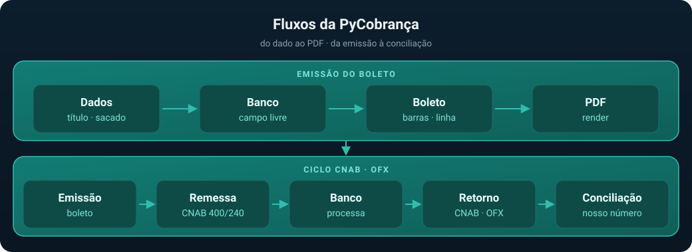

# 16 — Arquitetura e diretórios

Mapa do código: onde cada coisa mora, o que cada subsistema faz e como eles se encaixam. É o
documento de entrada para quem vai mexer no pacote (para a visão em camadas e as ADRs, ver
[`01-arquitetura.md`](01-arquitetura.md)).

## Fluxos



**Emissão do boleto.** Os dados do título (`valor`, `data_vencimento`, sacado, cedente) entram numa
subclasse de `BancoBase`. O banco monta as **25 posições do campo livre** com as regras do seu
manual; `montar_codigo_barras` prefixa banco/moeda/DV geral/fator/valor e fecha as **44 posições**;
`linha_digitavel` rearranja tudo nos 5 campos do IPTE (**47 dígitos**); `render` desenha o PDF a
partir de `contexto_render()`.

**Ciclo CNAB/OFX.** Os títulos emitidos viram `Pagamento` e são serializados numa **remessa** CNAB
400 ou 240, enviada ao banco. O banco devolve o **retorno** CNAB (liquidações, baixas, rejeições) e
o **extrato OFX**; ambos são lidos e casados com os boletos emitidos pelo **nosso número**
(`extrair_nosso_numero` + `concilia`).

## Árvore do repositório

```
pyCobranca/
├── pycobranca/           pacote da biblioteca (detalhado abaixo)
├── tests/                suíte pytest + fixtures congeladas (.rem, .RET, .ofx)
├── docs/                 esta documentação
│   ├── bancos/           um .md por banco + README (índice) + fontes-oficiais.md
│   └── images/           SVGs (banner, arquitetura, ciclo, diretórios) e screenshots
├── examples/             11 scripts executáveis, rodados pela CI a cada push
├── tools/                utilitários de manutenção (screenshots.py regera as capturas)
├── .github/workflows/    pipelines de CI e verificação
├── pyproject.toml        build PEP 517, deps, ruff (line-length 100) e pytest
├── README.md · CHANGELOG.md · CONTRIBUTING.md · LICENSE
```

## Árvore do pacote

```
pycobranca/
├── __init__.py                 __version__, banco_info(), BANCOS (lazy, derivado do REGISTRO)
├── exceptions.py               PyCobrancaError, BoletoInvalido (.erros), BancoNaoRegistrado,
│                               OFXInvalido, RetornoInvalido
│
├── core/                       núcleo utilitário — sem dependência de nenhuma outra camada
│   ├── __init__.py
│   ├── dv.py                   modulo10, modulo11_resto, modulo11_codigo_barras,
│   │                           modulo11_flex, duplo_digito
│   ├── datas.py                fator_vencimento, data_do_fator, BASE_FATOR, ROLLOVER_FATOR
│   └── documentos.py           so_digitos, validar_cpf/cnpj, formatar_cpf/cnpj
│
├── boleto/                     composição do título (independente de banco)
│   ├── __init__.py
│   ├── codigo_barras.py        montar_codigo_barras() — 44 posições, campo livre de 25
│   └── linha_digitavel.py      linha_digitavel() — IPTE, 47 dígitos, 3 DVs módulo 10
│
├── bancos/                     regras por banco + registro
│   ├── __init__.py             Bancos.todos/find/com_pix + exports das 19 classes
│   ├── base.py                 BancoBase (dataclass + ClassVars + validar) e REGISTRO
│   ├── ailos.py                085 — Ailos
│   ├── banco_do_brasil.py      001 — Banco do Brasil
│   ├── banco_nordeste.py       004 — Banco do Nordeste
│   ├── banestes.py             021 — Banestes
│   ├── banrisul.py             041 — Banrisul
│   ├── bradesco.py             237 — Bradesco
│   ├── brb.py                  070 — BRB (Banco de Brasília)
│   ├── c6.py                   336 — C6 Bank
│   ├── caixa.py                104 — Caixa Econômica Federal
│   ├── citibank.py             745 — Citibank
│   ├── credisis.py             097 — CrediSIS
│   ├── hsbc.py                 399 — HSBC (legado)
│   ├── inter.py                077 — Banco Inter (só a carteira 110)
│   ├── itau.py                 341 — Itaú
│   ├── safra.py                422 — Safra
│   ├── santander.py            033 — Santander
│   ├── sicoob.py               756 — Sicoob
│   ├── sicredi.py              748 — Sicredi
│   └── unicred.py              136 — Unicred
│
├── cnab/                       remessa e retorno FEBRABAN
│   ├── __init__.py             reexporta Pagamento e todas as classes Remessa*
│   ├── pagamento.py            Pagamento / PagamentoPix — título a registrar + formatadores
│   ├── formatacao.py           remover_acentos, format_size, format_valor,
│   │                           campo_numerico, confere_tamanhos
│   ├── cnab400/
│   │   ├── base.py             RemessaCnab400Base — header/detalhe/trailer, gera_arquivo()
│   │   ├── pix.py              PixMixinCnab400 (registro tipo 8) + Remessa*400Pix
│   │   └── <banco>.py          14 bancos: itau, bradesco, banco_brasil, santander, sicoob,
│   │                           unicred, banrisul, banco_nordeste, banco_brasilia, citibank,
│   │                           credisis, banco_c6, inter, safra
│   ├── cnab240/
│   │   ├── base.py             RemessaCnab240Base — header arq/lote, segmentos P/Q/R, trailers
│   │   ├── pix.py              segmento Y-03 + Remessa*240Pix
│   │   └── <banco>.py          7 bancos: ailos, banco_brasil, caixa, santander, sicoob,
│   │                           sicredi, unicred
│   └── retorno/
│       ├── __init__.py         Retorno.ler/ler_linhas — autodetecta layout e banco
│       ├── base.py             RegistroRetorno, extrai_campo, transforma_motivo, ATRIBUTOS
│       ├── cnab400.py          parse_cnab400, banco_do_arquivo_400 (código nas pos. 76–78)
│       ├── cnab240.py          parse_cnab240, banco_do_arquivo_240 (segmentos T + U)
│       └── ocorrencias.py      descreve_ocorrencia — rótulos legíveis por banco/layout
│
├── pix/
│   ├── __init__.py
│   ├── payload.py              PixPayload (BR Code EMV), crc16_ccitt, PixInvalido
│   └── qr.py                   qr_matrix (matriz de módulos), qr_svg
│
├── ofx/
│   ├── __init__.py
│   ├── parser.py               Extrato.ler (OFX v1 SGML e v2 XML), Transacao
│   ├── nosso_numero.py         extrair_nosso_numero — heurística por memo/instituição
│   └── conciliacao.py          concilia(), Conciliacao (conciliadas × pendentes)
│
├── contracts/
│   ├── __init__.py
│   └── contrato_rest.py        CONTRATO (OpenAPI 3.0), SLUG_POR_CODIGO, *_para_api,
│                               valida_contrato, ErroDeContrato
│
└── render/                     PDF via ReportLab
    ├── __init__.py             API pública: render_boleto_pdf, render_carne_pdf,
    │                           render_fatura_pdf, desenha_boleto, barcode, logos
    ├── comum.py                constantes, paleta e primitivas (canvas, texto, barcode, QR, logo)
    ├── tela.py                 Tela — canvas + cursor + coordenadas em mm, célula rotulada,
    │                           contenção de largura (cabe / cabe_corpo)
    ├── dados.py                DadosBoleto / extrai_dados — normaliza o contexto de render
    ├── blocos.py               blocos comuns aos modelos (rótulo, demonstrativo, corte)
    ├── modelos/                catálogo dos documentos
    │   ├── __init__.py         MODELOS_BOLETO, modelo_boleto() e o contrato de um modelo
    │   ├── boleto_classico.py  layout tradicional (bordas pretas, rótulos em caixa alta)
    │   ├── boleto_moderno.py   chips de destaque, faixa de marca, PIX, grade de 6 colunas
    │   ├── carne.py            render_carne_pdf — 3 parcelas por A4
    │   └── fatura.py           render_fatura_pdf — corpo livre + boleto na mesma página
    ├── barcode.py              Interleaved 2 of 5 (interleaved_2of5_svg / sequencia_i2of5)
    ├── marcas.py               logos empacotados dos bancos (logo_do_banco, bancos_com_logo)
    └── logos/                  logos/*.png (um por código FEBRABAN) + NOTICE.md
```

> **Adicionar um documento novo** custa um módulo em `modelos/`: as camadas de baixo (`comum`,
> `tela`, `dados`, `blocos`) são compartilhadas. O contrato do modelo — `MODERNO: bool` e
> `desenha(tela, info, contexto)` — está na docstring de `modelos/__init__.py`.

## Subsistemas

### `core/` — núcleo utilitário

Funções puras, sem estado e sem dependência de nenhuma outra camada. É a base de tudo: os DVs de
`dv.py` são usados pelo campo livre de cada banco, pelo DV geral do código de barras e pelos três
DVs de campo da linha digitável; `datas.fator_vencimento` implementa a regra FEBRABAN de reinício
do fator (a contagem voltou a 1000 em 22/02/2025); `documentos` valida CPF/CNPJ e fornece o
`so_digitos` que normaliza toda entrada com máscara.

### `boleto/` — código de barras e linha digitável

`montar_codigo_barras(banco, fator, valor_centavos, campo_livre)` monta as 44 posições e calcula o
DV geral (módulo 11 com a regra de colapsar 0/10/11 em 1). Rejeita campo livre que não tenha
**exatamente 25 dígitos** — é a fronteira que garante a corretude de todo banco novo.
`linha_digitavel(codigo_barras)` faz o rearranjo IPTE e devolve a string formatada de 47 dígitos.
Nenhum dos dois conhece banco algum.

### `bancos/` — registro + 19 bancos

`BancoBase` é uma `dataclass` com os campos do título e a composição pronta: as propriedades
`codigo_barras` e `linha_digitavel` chamam `validar()`, `campo_livre()` e as funções de `boleto/`.
Cada banco herda, declara os ClassVars (`codigo`, `nome`, `digito_banco`, `carteiras`,
`suporta_pix`, `regras_campos`) e implementa `campo_livre()`. O **auto-registro** acontece em
`__init_subclass__`, que insere a classe em `REGISTRO[codigo]`; a fachada `Bancos`
(`todos()`/`find()`/`com_pix()`) consulta esse dicionário — e `pycobranca.BANCOS` deriva dele, de
modo que a lista de bancos suportados nunca sai de sincronia. `contexto_render()` produz o
dicionário consumido pelo `render/`, incluindo o bloco `pix` (payload EMV + matriz do QR) quando
há chave PIX. Como adicionar um banco: [`15-novo-banco.md`](15-novo-banco.md).

### `cnab/` — remessa 400/240 e retorno

`Pagamento` (e `PagamentoPix`) descreve o título a registrar e concentra os **formatadores**
posicionais (`formata_valor`, `formata_valor_mora`, `formata_data_desconto`, …), além de
`validar()`, que confere obrigatórios e a coerência dos encargos. `RemessaCnab400Base` e
`RemessaCnab240Base` implementam a estrutura comum do layout e deixam ganchos por banco; o
`gera_arquivo()` de ambas valida os pagamentos, confere o tamanho de cada registro
(`tamanho_registro`, desligável para layouts proprietários), remove acentos, aplica `upper()` e
grava com CRLF. O `retorno/` faz o caminho inverso: `Retorno.ler` detecta o layout pelo tamanho do
primeiro registro e o banco pelo header, e devolve `RegistroRetorno` com os valores **crus** do
arquivo. Detalhes em [`06-cnab.md`](06-cnab.md).

### `pix/` — Bolepix

`PixPayload.br_code()` monta o payload EMV (BR Code copia-e-cola) com CRC16-CCITT; `qr_matrix`
devolve a matriz de módulos que o renderizador desenha vetorialmente no PDF e `qr_svg` gera uma
pré-visualização. O subsistema é acionado por `BancoBase._contexto_pix()` — só para bancos com
`suporta_pix=True` — e pelos mixins PIX da remessa (registro tipo 8 no 400, segmento Y-03 no 240).
Ver [`07-pix.md`](07-pix.md).

### `ofx/` — extrato e conciliação

`Extrato.ler` aceita OFX v1 (SGML) e v2 (XML) em Latin-1 ou UTF-8 e devolve `Transacao`s com data,
valor, memo e o `nosso_numero_extraido`. `concilia(extrato, nossos_numeros)` casa as transações
com os títulos emitidos e devolve uma `Conciliacao` (conciliadas × pendentes). É o fecho do ciclo,
complementar ao retorno CNAB. Ver [`13-ofx.md`](13-ofx.md).

### `contracts/` — contrato REST

Serializadores dos artefatos para JSON no formato do contrato OpenAPI 3.0
(`boleto_para_api`, `pagamento_para_api`, `remessa_para_api`, `retorno_item_para_api`) e
`valida_contrato`, um validador leve que levanta `ErroDeContrato`. A PyCobrança **não** expõe HTTP:
ela apenas produz o payload que uma camada REST publica. Ver [`04-api-rest.md`](04-api-rest.md).

### `render/` — PDF

Backend único **ReportLab**, Python puro, sem dependências de sistema. Entrada: o dicionário de
`contexto_render()`. Saída: `bytes` de PDF — `render_boleto_pdf(ctx, modelo=...)` nos modelos
`classico` e `moderno` (com Bolepix e tema) e `render_carne_pdf` (3 parcelas por A4). O código de
barras é desenhado a partir da sequência Interleaved 2 of 5 gerada em `barcode.py`, e `marcas.py`
expõe os logos empacotados por código FEBRABAN. Ver [`11-renderizacao.md`](11-renderizacao.md).

### `exceptions.py` — contrato de erros

Toda falha de domínio herda de `PyCobrancaError`. A mais relevante para um consumidor é
`BoletoInvalido`, que carrega `.erros` como **lista** (um item por violação), permitindo mapear
cada problema individualmente. Ver [`14-validacao-campos.md`](14-validacao-campos.md).

## Dependências entre subsistemas

As setas apontam sempre para dentro: nada em `core/` conhece bancos, e nada em `bancos/` conhece
CNAB, OFX ou render.

Notação: `A ◀── B` significa "B importa A".

```
exceptions ......... transversal — toda camada levanta PyCobrancaError

core ◀── boleto ◀── bancos ──▶ pix          (Bolepix no boleto)
  ▲                    │
  │                    └──▶ contexto_render() (dict) ──▶ render ──▶ PDF
  │
  └── cnab ──▶ pix                          (registro tipo 8 / segmento Y-03)

ofx ......... parser + conciliação pelo nosso número (não importa core/bancos/cnab)
contracts ... serializa boleto · pagamento · remessa · retorno em JSON
```

| Subsistema | Depende de | Não depende de |
|------------|------------|----------------|
| `core` | — | todo o resto |
| `boleto` | `core` | `bancos`, `cnab`, `render` |
| `bancos` | `core`, `boleto`, `exceptions`, `pix` (import tardio) | `cnab`, `ofx`, `render` |
| `cnab` | `core`, `exceptions` | `bancos`, `render` |
| `pix` | `exceptions`, `qrcode` (import tardio) | `core`, `bancos`, `cnab` |
| `ofx` | `exceptions` | `core`, `bancos`, `cnab` |
| `render` | `reportlab` (+ contexto em dicionário) | `bancos`, `cnab` |
| `contracts` | `cnab.retorno.ocorrencias` (import tardio) | HTTP/framework web |

O acoplamento entre `bancos` e `render` é **por dicionário**, não por import: o banco produz
`contexto_render()` e o renderizador consome esse contrato. Por isso os dois evoluem
independentemente — e por isso a reorganização de `render/` não toca em nenhum banco.
